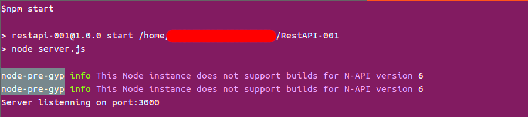
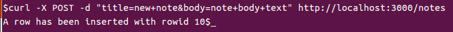
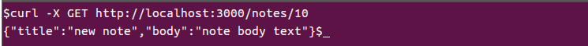
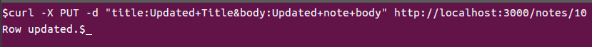
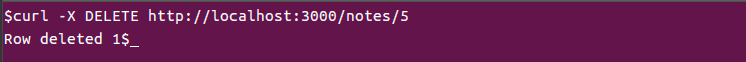

# nodejs-restapidemo
This is a demo app built using NodeJs as a REST API. The API has four function create, read, delete and update.

The API in this example is used to create, read, delete and update notes. Notes are stored in SqliteDB.

This demo is based on this [video tutorial](https://yewtu.be/watch?v=fsCjFHuMXj0). The only difference is that I am using local Sqlite instead of an online MongoDB used in the video.  

# SqliteDB
Sqlite is used to store the notes in a file, inside the db folder.


# Usage
Clone the repo to a direcoty and use the command

```
$npm start
```



# Rest API

## Create
Use the following to make a new note

```
$ curl -X POST -d "title=new+note&body=note+body+text" http://localhost:3000/notes
```




## Read
Use the following to read note by its ID

```
$ curl -X GET http://localhost:3000/notes/<ID>
```



## Update
Use the following to update a note

```
$ curl -X PUT -d "title=Updated+Title&body=Updated+note+body" http://localhost:3000/notes/<ID>
```



## Delete
Use the following to update a note

```
$ curl -X PUT -d "title=Updated+Title&body=Updated+note+body" http://localhost:3000/notes/<ID>
```




